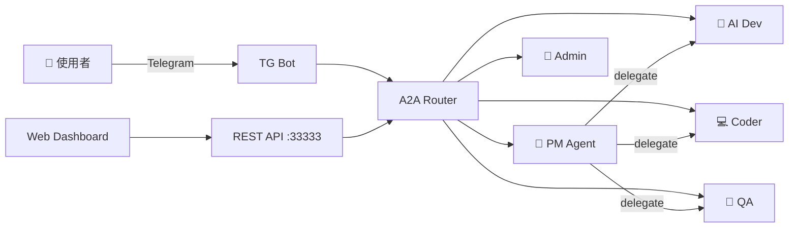
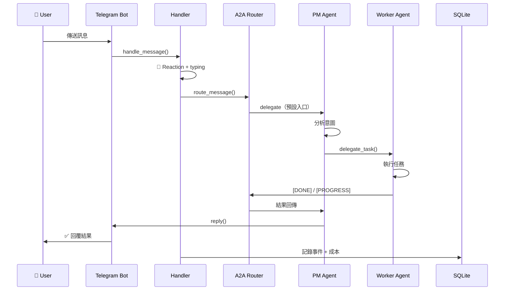
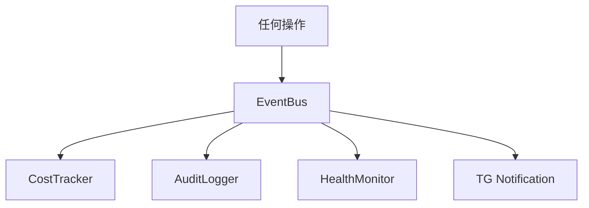
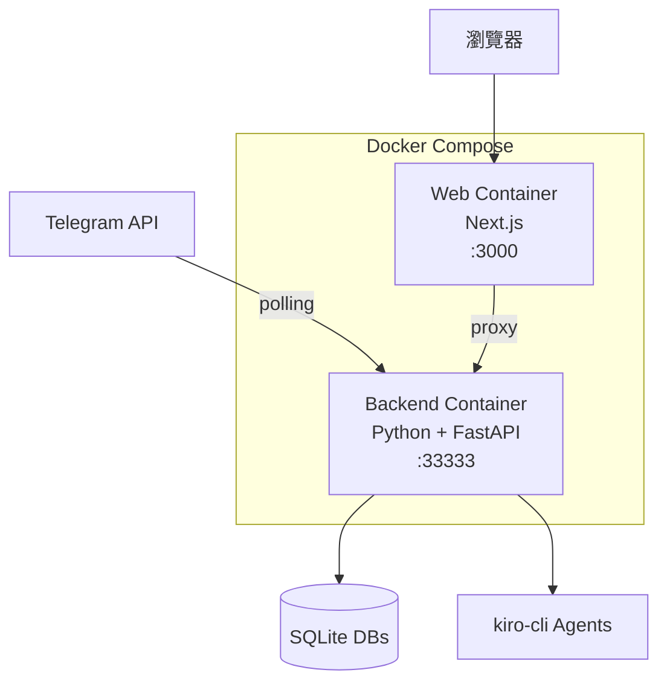

# AI Team Agent — 系統架構文件

> 最後更新：2026-06-24

## 1. 系統總覽

AI Team Agent 是一個多 Agent 協作平台，透過 Telegram Bot 接收使用者指令，由 PM Agent 拆解需求並分派給專業 Agent 執行，最終回報結果。平台採用事件驅動架構，所有 Agent 間通訊透過 A2A Router 協調。



## 2. 技術棧

| 層級 | 技術 |
|------|------|
| 語言 | Python 3.12 |
| Web 框架 | FastAPI + Uvicorn |
| Agent 引擎 | kiro-cli |
| 資料庫 | SQLite（aiosqlite） |
| 事件系統 | 自建 EventBus（pub/sub） |
| Telegram | python-telegram-bot |
| LLM | Gemini（via gateway） |
| 前端 Dashboard | Next.js + Tailwind |
| 部署 | Docker Compose |

## 3. 目錄結構

```
ai-team-agent/
├── start.py                 # 入口
├── team.yaml                # 團隊配置
├── scheduler.yaml           # 排程定義
├── src/                     # 核心程式碼
│   ├── bootstrap.py         # 啟動編排
│   ├── runtime/             # 進程管理、排程、config
│   ├── coordinator/         # DB、EventBus、A2A、Services
│   ├── gateway/             # REST API + Telegram Bot
│   └── business/            # 業務邏輯
├── agents/                  # 5 個 Agent 工作空間
├── skills/                  # 55 個 Skills
├── knowledge/               # Wiki 知識庫
├── apps/web/                # Next.js Dashboard
├── docs/                    # 規格/設計文件
├── tasks/                   # 任務板
├── tests/                   # pytest
├── data/                    # SQLite DBs
├── config/                  # 設定檔
└── secrets/                 # 敏感資料
```

## 4. 核心模組

### 4.1 Runtime（`src/runtime/`）

| 檔案 | 職責 |
|------|------|
| `process.py` | Agent 進程生命週期管理（啟動/停止/重啟） |
| `daemon.py` | 背景服務守護 |
| `scheduler.py` | 定時任務排程（依 scheduler.yaml） |
| `config.py` | team.yaml 解析為 Python 物件 |
| `mcp_registry.py` | MCP 工具註冊與查詢 |

### 4.2 Coordinator（`src/coordinator/`）

#### DB（`db/`）
- `models.py` — SQLite async CRUD（init_db / fetch / insert）
- `migrations/001_init.sql` — Schema 定義

#### Events（`events/`）
- `bus.py` — EventBus 實現（subscribe / publish / async handlers）
- `types.py` — EventType 枚舉 + Event dataclass

#### A2A（`a2a/`）
- `router.py` — Agent 間訊息路由
- `graph.py` — 任務依賴圖（DAG）
- `shared_memory.py` — 跨 Agent 共享記憶體
- `feedback_loop.py` — 任務結果回饋迴圈
- `progress_parser.py` — Output Marker 解析（[DONE]/[PROGRESS]/[FAIL]）
- `discovery.py` — Agent 能力發現
- `protocol.py` — A2A 通訊協定定義

#### Services（`services/`）
- `cost_tracker.py` — Token 使用量 + 費用追蹤（日限 $30）
- `health_monitor.py` — Agent 健康檢查
- `audit_logger.py` — 全事件稽核日誌

### 4.3 Gateway（`src/gateway/`）

#### REST API（`api/`）
| 端點 | 檔案 | 用途 |
|------|------|------|
| `/api/agents` | `agents.py` | Agent CRUD + 狀態查詢 |
| `/api/issues` | `issues.py` | 任務管理（建立/指派/更新） |
| `/api/costs` | `costs.py` | 成本查詢 |
| `/api/schedules` | `schedules.py` | 排程管理 |
| `/api/admin/*` | `admin.py` | 管理操作（重啟/設定） |
| `/ws` | `ws.py` | WebSocket 即時推送 |

#### Telegram（`telegram/`）
- `bot.py` — Bot 初始化 + polling
- `handlers/commands.py` — /start /status /help 等指令
- `handlers/messages.py` — 一般訊息處理 + Agent 路由
- `handlers/callbacks.py` — Inline button 回調
- `notifications.py` — 主動通知推送
- `formatters.py` — 訊息格式化（Markdown/HTML）
- `progress.py` — 任務進度即時更新
- `topics.py` — Group Topics 管理

### 4.4 Business（`src/business/`）

| 檔案 | 職責 |
|------|------|
| `web_search.py` | 網路搜尋整合 |
| `news_scraper.py` | 新聞來源爬取 |
| `news_renderer.py` | 新聞格式化輸出 |

## 5. Agent 團隊

| Agent | 角色 | 職責 | 工作目錄 |
|-------|------|------|----------|
| admin-agent | 👑 Admin | 服務管理、開發維護、團隊指揮 | `agents/admin-agent/` |
| leader-agent | 🧠 Leader | 需求分析、派工、驗收 | `agents/leader-agent/` |
| ai-dev-agent | 🤖 Worker | AI/ML 架構、Prompt 工程 | `agents/ai-dev-agent/` |
| coder-agent | 💻 Worker | 全端開發、API 實作 | `agents/coder-agent/` |
| qa-agent | 🧪 Worker | 測試、品質保證 | `agents/qa-agent/` |

**指揮鏈**：`使用者 → admin → leader → worker`

每個 Agent 工作空間含：
- `.kiro/steering/` — 行為準則（SOUL / MEMORY / TEAM）
- `.kiro/skills/` — 可用 Skills
- `knowledge/` — 個人知識庫
- `data/` / `docs/` / `output/`

## 6. Skills 概覽

共 55 個 Skill，以 `ark-` 為前綴，分類如下：

| 類別 | Skills |
|------|--------|
| 文件產出 | superpowers, doc-coauthoring, report-template, uml-generator |
| 開發工具 | code-review, test-runner, mcp-builder, env-doctor, docker-deploy |
| AI/Bot | ai-bot-builder, chatbot-generator, llm-cli, llm-tools |
| 資料分析 | data-dashboard, kpi-calculator, retention-analysis, db-query, etl-pipeline |
| 設計 | ui-design-system, frontend-design, canvas-design, theme-factory |
| 檔案工具 | pdf-tool, docx-tool, xlsx-tool, pptx-tool, file-export |
| Web | webapp-generator, web-scraper, browser-tool, landing-page, html-dashboard |
| 專案管理 | project-planning, planning-with-files, skill-creator, agent-team-builder |
| 驗證 | code-spec-validator, ux-spec-validator, security-audit |
| 知識管理 | wiki-engine |
| 通訊 | telegram-bot, internal-comms, community-ops, marketing |
| 其他 | news-daily, chart-generator, translator, anomaly-detector, cost-tracker, executive-assistant, scheduler-generator, game-design-doc, dashboard-health, kiro-init |

## 7. 資料流

### 使用者訊息處理流程



### 事件流



## 8. 部署架構



**資料庫**：
- `data/platform.db` — 主資料庫（agents / issues / costs / schedules）
- `data/memory.db` — Agent 記憶
- `data/events.db` — 事件日誌

## 9. 設定檔說明

| 檔案 | 用途 |
|------|------|
| `team.yaml` | 團隊定義（Agent 列表、權限、成本限制、TG 設定） |
| `scheduler.yaml` | 排程任務（cron 表達式 + 執行目標） |
| `.env` | 環境變數（API keys、Bot token） |
| `config/news_sources.yaml` | 新聞來源設定 |
| `.kiro/settings/mcp.json` | MCP 工具設定 |

---

## 附錄：快速啟動

```bash
# 1. 環境準備
cp .env.example .env
# 填入 TELEGRAM_BOT_TOKEN, GEMINI_API_KEY

# 2. 安裝依賴
python -m venv .venv
source .venv/bin/activate
pip install -r requirements.txt

# 3. 啟動
python start.py

# 4. Docker 部署
docker-compose -f docker-compose.prod.yml up -d
```
