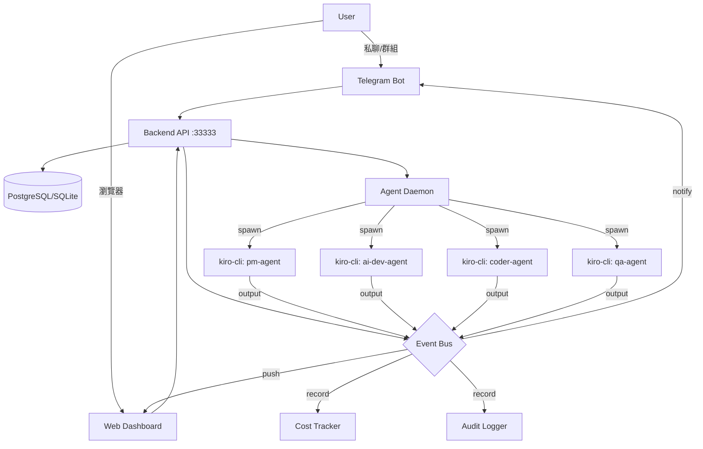

# Ark Agent Platform — 設計文件

## 1. 設計目標

將 `ark-agent-team-builder` 的最小 daemon（282 行）升級為完整的 Agent 管理平台：

| 現狀 | 目標 |
|------|------|
| 純 stdin/stdout 通訊 | REST API + WebSocket + Telegram |
| 記憶體狀態（重啟歸零） | PostgreSQL 持久化 |
| 無費用追蹤 | 自動記錄每次 spawn 的 token/費用 |
| 無審計 | 所有操作自動記錄 |
| 單一 health endpoint | 完整監控 + 自動重啟 + 警報 |
| 純文字 Telegram | Rich UI（卡片/按鈕/進度條/通知） |

---

## 2. 架構總覽



---

## 3. 三層架構設計

### Layer 1：Telegram UI 層

> 詳見 `docs/specs/ark-telegram-ui-spec.md`（976 行）

| 模組 | 職責 |
|------|------|
| `src/telegram/bot.py` | Application 入口 + handler 註冊 |
| `src/telegram/handlers/commands.py` | 11 個 slash 指令 |
| `src/telegram/handlers/messages.py` | 自然語言路由（@mention + 關鍵字） |
| `src/telegram/handlers/callbacks.py` | InlineKeyboard callback |
| `src/telegram/formatters.py` | 5 種卡片模板（status/completed/board/cost/blocker） |
| `src/telegram/keyboards.py` | InlineKeyboard 工廠 |
| `src/telegram/notifications.py` | Event Bus → TG 推送 |
| `src/telegram/progress.py` | edit_message 進度更新 |

### Layer 2：Backend API 層

> 詳見 `docs/specs/ark-backend-tool-spec.md`（586 行）

| 模組 | 職責 |
|------|------|
| `src/backend/api/router.py` | FastAPI app + middleware + CORS |
| `src/backend/api/admin.py` | Admin endpoints（dashboard/sessions/costs/audit/queue） |
| `src/backend/api/agents.py` | Agent CRUD + control（start/stop/abort） |
| `src/backend/api/issues.py` | Issue lifecycle（create/assign/complete/fail） |
| `src/backend/api/ws.py` | WebSocket /ws/events 即時推送 |
| `src/backend/db/database.py` | async DB 連線（SQLite dev / PostgreSQL prod） |
| `src/backend/db/models.py` | 6 張表 ORM |
| `src/backend/events/bus.py` | EventBus（asyncio pub/sub） |
| `src/backend/services/cost_tracker.py` | 費用自動記錄 |
| `src/backend/services/audit_logger.py` | 審計自動記錄 |
| `src/backend/services/health_monitor.py` | 健康監控 + 自動重啟 |

### Layer 3：Agent Runtime 層

> 升級自現有 `src/ark_team_core/`

| 模組 | 變更 |
|------|------|
| `config.py` | 不動 |
| `process.py` | +cost hook（spawn 完成後 emit `agent.output` event） |
| `daemon.py` | +event bus 注入、emit `agent.started/stopped` |
| `mcp_registry.py` | 不動 |
| `scheduler.py` | +CRUD methods（add/update/remove/list） |

---

## 4. Event Bus 設計（核心中樞）

```python
class EventType(str, Enum):
    # Agent lifecycle
    AGENT_STARTED = "agent.started"
    AGENT_STOPPED = "agent.stopped"
    AGENT_OUTPUT = "agent.output"
    AGENT_BUSY = "agent.busy"
    
    # Task lifecycle
    TASK_CREATED = "task.created"
    TASK_ASSIGNED = "task.assigned"
    TASK_COMPLETED = "task.completed"
    TASK_FAILED = "task.failed"
    TASK_BLOCKER = "task.blocker"
    
    # System
    COST_RECORDED = "cost.recorded"
    BUDGET_WARNING = "budget.warning"
    HEALTH_CHECK = "system.health_check"
    SYSTEM_RESTART = "system.restart"

@dataclass
class Event:
    type: EventType
    data: dict
    timestamp: datetime = field(default_factory=datetime.now)
    source: str = ""

class EventBus:
    def __init__(self):
        self._subscribers: dict[EventType, list[Callable]] = defaultdict(list)
        self._queue: asyncio.Queue = asyncio.Queue()

    def subscribe(self, event_type: EventType, handler: Callable) -> None:
        self._subscribers[event_type].append(handler)

    async def emit(self, event: Event) -> None:
        await self._queue.put(event)

    async def start(self) -> None:
        while True:
            event = await self._queue.get()
            handlers = self._subscribers.get(event.type, [])
            for handler in handlers:
                asyncio.create_task(handler(event))
```

### 事件訂閱關係

```
agent.output ──→ TG notifications (回覆使用者)
             ──→ cost_tracker (記錄費用)
             ──→ WebSocket push (Web Dashboard)

task.completed ──→ TG notify (✅ 完成通知)
               ──→ audit_logger (記錄)

task.failed ──→ TG notify (❌ 失敗通知)
            ──→ audit_logger

budget.warning ──→ TG notify (⚠️ 預算警報)

system.health_check ──→ health_monitor (檢查 + 重啟)
                    ──→ TG notify (if 異常)
```

---

## 5. 資料流

### 派工流程

```
1. User 在 TG 發送「建立一個 API」
2. telegram/handlers/messages.py 收到
3. 判斷路由 → pm-agent (leader)
4. POST /api/issues {title: "建立一個 API", assignee: "pm-agent"}
5. issues.py 建立 Issue → DB
6. emit TASK_CREATED + TASK_ASSIGNED
7. daemon.send_to("pm-agent", "建立一個 API")
8. process.py spawn kiro-cli
9. TG 回覆「⏳ pm-agent 處理中...」
10. kiro-cli 完成 → stdout output
11. process.py emit AGENT_OUTPUT
12. notifications.py 收到 → TG 回覆結果
13. cost_tracker 收到 → 記錄費用
14. audit_logger 收到 → 記錄操作
```

### 監控流程

```
1. health_monitor 每 30s 檢查所有 agent
2. 發現 agent 離線 → emit SYSTEM_RESTART
3. daemon 自動重啟 agent
4. emit AGENT_STARTED
5. 若 5 分鐘內重啟 > 3 次 → emit BUDGET_WARNING (type=health)
6. TG 通知管理員
```

---

## 6. 替代方案比較

| | 方案 A：Python 全棧 | 方案 B：Go + Python | 方案 C：Fork Multica |
|---|---|---|---|
| 語言 | Python (FastAPI) | Go backend + Python TG | Go + TypeScript |
| 優點 | 與現有 ark_team_core 無縫整合、開發快 | 效能好、對齊 Multica | 功能最完整 |
| 缺點 | 高併發瓶頸 | 雙語言維護成本 | 過重、學習曲線 |
| 開發時間 | 6 週 | 8 週 | 12+ 週 |
| 適合 | 小團隊（≤50 agents） | 中團隊 | 大團隊 |

**決策：方案 A（Python 全棧）**

理由：
1. 團隊熟 Python，與現有 282 行 core 直接整合
2. 6 週可交付 MVP
3. FastAPI 效能足夠（50 agents、100 concurrent users）
4. 未來可漸進遷移到 Go（API 層替換，event bus 不變）

---

## 7. 安全性設計

| 面向 | 措施 |
|------|------|
| API 認證 | Bearer token（JWT for Web、API Key for daemon） |
| TG 認證 | user_id → workspace 綁定表（`tg_user_bindings`） |
| RBAC | admin（全部權限）/ member（派工+查看）/ viewer（只看） |
| Agent 操作 | 所有 mutation emit audit event → 不可刪除 |
| 敏感資料 | .env 存 token、DB 存 hash、日誌不印 secret |
| Rate limit | TG: 20 msg/min per user、API: 100 req/min per key |

---

## 8. 部署架構

### 開發模式

```bash
python start.py
# 單進程啟動全部：API + TG Bot + Agent Daemon + Event Bus + Scheduler
# SQLite 存 data/platform.db
```

### 生產模式

```yaml
# docker-compose.prod.yml
services:
  postgres:
    image: postgres:17
    volumes: [pgdata:/var/lib/postgresql/data]

  backend:
    build: .
    command: python -m src.backend.api.router
    depends_on: [postgres]
    ports: ["33333:33333"]

  telegram-bot:
    build: .
    command: python -m src.telegram.bot
    depends_on: [backend]

  agent-daemon:
    build: .
    command: python -m src.ark_team_core.daemon
    depends_on: [backend]
    volumes: [./agents:/app/agents]
```

---

## 9. 風險與緩解

| 風險 | 影響 | 機率 | 緩解 |
|------|------|------|------|
| kiro-cli 版本不相容 | Agent 無法啟動 | 中 | Pin 版本 + 啟動前 version check |
| LLM 費用失控 | 超預算 | 高 | cost_guard + budget warning + 自動暫停 |
| SQLite 併發限制 | 資料遺失 | 低 | 開發用 SQLite、生產用 PostgreSQL |
| Telegram API 限流 | 通知延遲 | 中 | 訊息佇列 + 節流（500ms） |
| Event Bus 記憶體洩漏 | OOM | 低 | Queue maxsize + 定期 drain |

---

## 10. 統一執行計畫

### 6 週排程

| 週 | 重點 | 交付物 |
|----|------|--------|
| **W1** | Backend 基礎 | DB schema + Event Bus + API router + 基本 CRUD |
| **W2** | Backend 完整 | Admin API (5 域) + Cost/Audit services |
| **W3** | Telegram 基礎 | Bot 骨架 + 11 指令 + 5 種格式化模板 |
| **W4** | Telegram 互動 | InlineKeyboard + Notifications + Group Topics |
| **W5** | 整合 | TG ↔ Backend 完整串接 + WebSocket push |
| **W6** | 打磨 | RBAC + Docker + E2E 測試 + 文件 |

### 每日細部排程

#### Week 1：Backend 基礎

| 天 | 任務 | 產出 |
|----|------|------|
| D1 | DB schema 設計 + migration | `src/backend/db/models.py` + `migrations/001_init.sql` |
| D2 | EventBus 實作 + 單元測試 | `src/backend/events/bus.py` + `tests/test_events.py` |
| D3 | FastAPI router + health + agents CRUD | `src/backend/api/router.py` + `agents.py` |
| D4 | Issues lifecycle API | `src/backend/api/issues.py` |
| D5 | WebSocket endpoint + 整合測試 | `src/backend/api/ws.py` + `tests/test_api.py` |

#### Week 2：Backend 完整

| 天 | 任務 | 產出 |
|----|------|------|
| D6 | Admin dashboard stats + trends API | `src/backend/api/admin.py` |
| D7 | Session Inspector API（list + detail） | admin.py sessions 段 |
| D8 | Cost Tracker service + API | `src/backend/services/cost_tracker.py` |
| D9 | Audit Logger service + API | `src/backend/services/audit_logger.py` |
| D10 | Health Monitor + Queue Manager API | `health_monitor.py` + admin.py queue 段 |

#### Week 3：Telegram 基礎

| 天 | 任務 | 產出 |
|----|------|------|
| D11 | Bot 骨架 + /start /status /agents | `src/telegram/bot.py` + `handlers/commands.py` |
| D12 | /board /costs /queue 指令 | commands.py 擴充 |
| D13 | Formatters（5 種卡片模板） | `src/telegram/formatters.py` |
| D14 | /assign 流程 + InlineKeyboard | `handlers/callbacks.py` + `keyboards.py` |
| D15 | 自然語言路由（@mention） | `handlers/messages.py` |

#### Week 4：Telegram 互動

| 天 | 任務 | 產出 |
|----|------|------|
| D16 | NotificationService（Event Bus → TG） | `src/telegram/notifications.py` |
| D17 | 任務完成/失敗/blocker 通知 | notifications.py handlers |
| D18 | Progress 更新器（edit_message） | `src/telegram/progress.py` |
| D19 | Group Topics 路由 | messages.py + topic 管理 |
| D20 | 審批 flow + /stop /retry /logs | callbacks.py 擴充 |

#### Week 5：整合

| 天 | 任務 | 產出 |
|----|------|------|
| D21 | process.py → Event Bus 串接 | ark_team_core 升級 |
| D22 | TG commands → Backend API 串接 | API client 整合 |
| D23 | WebSocket → TG 通知完整流程 | 端到端測試 |
| D24 | start.py 統一入口（dev mode 全啟動） | start.py 重構 |
| D25 | 整合測試 + bug 修復 | `tests/test_integration.py` |

#### Week 6：打磨

| 天 | 任務 | 產出 |
|----|------|------|
| D26 | RBAC 權限控制 | `src/backend/api/auth.py` |
| D27 | Docker Compose 生產配置 | `docker-compose.prod.yml` |
| D28 | E2E 測試（Playwright + TG mock） | `e2e/` |
| D29 | 效能優化 + 壓力測試 | benchmark 報告 |
| D30 | 文件 + README + CHANGELOG | `docs/` 更新 |

---

## 11. 檔案結構總覽

```
my-team/
├── src/
│   ├── ark_team_core/          # 現有（小改）
│   │   ├── config.py
│   │   ├── process.py          # +event emit
│   │   ├── daemon.py           # +event bus inject
│   │   ├── mcp_registry.py
│   │   └── scheduler.py        # +CRUD
│   │
│   ├── backend/                # 新增
│   │   ├── api/
│   │   │   ├── router.py
│   │   │   ├── admin.py
│   │   │   ├── agents.py
│   │   │   ├── issues.py
│   │   │   └── ws.py
│   │   ├── db/
│   │   │   ├── database.py
│   │   │   ├── models.py
│   │   │   └── migrations/
│   │   ├── events/
│   │   │   ├── bus.py
│   │   │   ├── types.py
│   │   │   └── handlers.py
│   │   └── services/
│   │       ├── cost_tracker.py
│   │       ├── audit_logger.py
│   │       └── health_monitor.py
│   │
│   ├── telegram/               # 新增
│   │   ├── bot.py
│   │   ├── handlers/
│   │   │   ├── commands.py
│   │   │   ├── messages.py
│   │   │   └── callbacks.py
│   │   ├── formatters.py
│   │   ├── keyboards.py
│   │   ├── notifications.py
│   │   └── progress.py
│   │
│   └── my_team/                # 現有業務層（保留）
│
├── docs/
│   ├── specs/
│   │   ├── ark-telegram-ui-spec.md    # 976 行
│   │   └── ark-backend-tool-spec.md   # 586 行
│   └── ark-platform-design.md         # 本文件
│
├── data/                       # SQLite 存放（dev mode）
├── docker-compose.prod.yml     # 生產部署
├── start.py                    # 統一入口
└── team.yaml                   # 團隊配置
```

---

## 12. 成功指標

| 指標 | 目標 | 衡量方式 |
|------|------|---------|
| 派工到完成 | 從 TG 發訊到收到結果 < 2 min（簡單任務） | 端到端計時 |
| API 延遲 | P95 < 200ms | benchmark |
| 通知延遲 | Event → TG 推送 < 5s | 日誌計時 |
| 費用追蹤準確度 | 與實際 API 帳單誤差 < 10% | 月底比對 |
| 可用性 | 99.5% uptime | health_monitor 記錄 |
| 開發速度 | 6 週 MVP | 每週 demo |
