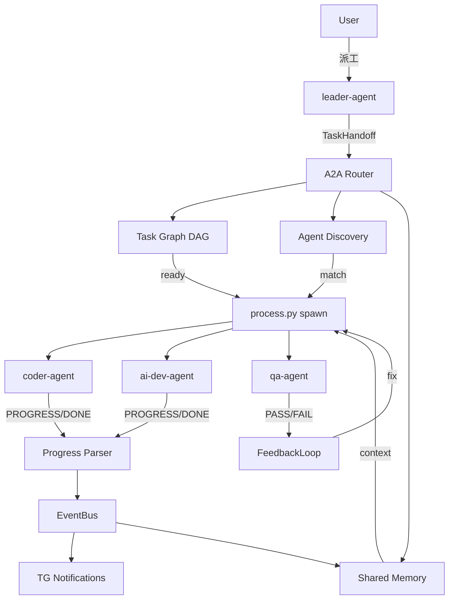

# A2A 協作機制 — 設計文件

## 1. 設計目標

讓 5 個 agent 從「各做各的」升級為「真正協作」，實現：
- Agent 間有標準交接協議
- 任務有 DAG 依賴關係
- 失敗自動觸發修復迴圈
- Context 透過共享記憶傳遞（不浪費 token）

---

## 2. 架構總覽



---

## 3. 元件設計

### 3.1 A2A Router（核心協調器）

```python
class A2ARouter:
    """A2A 協作核心 — 協調 Task Handoff、依賴、路由。"""

    def __init__(self, graph: TaskGraph, discovery: AgentDiscovery,
                 memory: SharedMemory, event_bus: EventBus):
        self.graph = graph
        self.discovery = discovery
        self.memory = memory
        self.bus = event_bus

    async def dispatch(self, handoff: TaskHandoff) -> None:
        """接收 handoff → 檢查依賴 → 匹配 agent → spawn。"""
        # 1. 寫入 shared memory
        self.memory.write_task(handoff)

        # 2. 加入依賴圖
        self.graph.add_task(handoff)

        # 3. 檢查是否 ready
        if not self.graph.is_ready(handoff.task_id):
            await self.bus.emit(Event(type="task.queued", data={"task_id": handoff.task_id}))
            return  # 等依賴完成後自動觸發

        # 4. 匹配 agent（如果是 auto）
        target = handoff.to_agent
        if target == "auto":
            target = self.discovery.match(handoff)

        # 5. 組裝 context（含 shared memory）
        context = self.memory.get_task_context(handoff.task_id)

        # 6. Spawn
        await self._spawn(target, handoff, context)

    async def on_task_complete(self, task_id: str, output: str) -> None:
        """任務完成 → 更新圖 → 解鎖下游 → 自動派工。"""
        self.memory.update_task(task_id, status="completed", output=output)
        unlocked = self.graph.mark_complete(task_id, output)
        for next_task in unlocked:
            await self.dispatch(next_task)

    async def on_task_failed(self, task_id: str, reason: str) -> None:
        """任務失敗 → 檢查是否有 feedback loop。"""
        task = self.graph.get_task(task_id)
        if task.loop_back and task.max_iterations > 0:
            # 觸發修復迴圈
            await self._start_feedback_loop(task, reason)
        else:
            self.graph.mark_failed(task_id, reason)
```

### 3.2 Task Graph（DAG）

```python
class TaskGraph:
    def __init__(self):
        self._tasks: dict[str, TaskHandoff] = {}
        self._status: dict[str, str] = {}  # pending/running/completed/failed
        self._outputs: dict[str, str] = {}

    def add_task(self, task: TaskHandoff) -> None:
        self._tasks[task.task_id] = task
        self._status[task.task_id] = "pending"

    def is_ready(self, task_id: str) -> bool:
        task = self._tasks[task_id]
        return all(self._status.get(dep) == "completed" for dep in task.depends_on)

    def mark_complete(self, task_id: str, output: str) -> list[TaskHandoff]:
        self._status[task_id] = "completed"
        self._outputs[task_id] = output
        # 找出被解鎖的下游
        unlocked = []
        for tid, task in self._tasks.items():
            if self._status[tid] == "pending" and task_id in task.depends_on:
                if self.is_ready(tid):
                    unlocked.append(task)
        return unlocked
```

### 3.3 Progress Parser

```python
import re

PATTERNS = {
    "progress": re.compile(r"\[PROGRESS\] step=(\d+)/(\d+) msg=(.+)"),
    "artifact": re.compile(r"\[ARTIFACT\] path=(\S+) msg=(.+)"),
    "blocker":  re.compile(r"\[BLOCKER\] need=(\S+) msg=(.+)"),
    "done":     re.compile(r"\[DONE\] summary=(.+?)(?:\s+artifacts=(.+))?$"),
    "fail":     re.compile(r"\[FAIL\] reason=(\S+) msg=(.+)"),
}

def parse_line(line: str) -> dict | None:
    for kind, pattern in PATTERNS.items():
        m = pattern.match(line)
        if m:
            return {"type": kind, "groups": m.groups()}
    return None
```

整合到 `process.py`：
```python
async def _read_output(self) -> None:
    for line in stdout_lines:
        parsed = parse_line(line)
        if parsed:
            await self.event_bus.emit(Event(
                type=f"task.{parsed['type']}",
                data={"agent": self.name, **parsed},
            ))
```

### 3.4 Shared Memory

```python
class SharedMemory:
    """檔案系統共享記憶體。"""

    def __init__(self, base: Path = Path("knowledge/shared")):
        self.base = base
        (self.base / "tasks").mkdir(parents=True, exist_ok=True)
        (self.base / "artifacts").mkdir(parents=True, exist_ok=True)

    def write_task(self, task: TaskHandoff) -> None:
        path = self.base / "tasks" / f"{task.task_id}.md"
        content = f"""---
task_id: {task.task_id}
status: implemented
assigned_to: {task.to_agent}
depends_on: {task.depends_on}
created_by: {task.from_agent}
---
# {task.title}
## Context
{task.context}
## Deliverables
{chr(10).join(f'- [ ] {d}' for d in task.deliverables)}
## Acceptance Criteria
{task.acceptance_criteria}
"""
        path.write_text(content, encoding="utf-8")

    def get_task_context(self, task_id: str) -> str:
        """取得任務 context + 依賴的 output。"""
        task_file = self.base / "tasks" / f"{task_id}.md"
        context = task_file.read_text(encoding="utf-8") if task_file.exists() else ""
        return context

    def update_task(self, task_id: str, **kwargs) -> None:
        # 更新 frontmatter 的 status
        ...
```

### 3.5 Feedback Loop

```python
class FeedbackLoop:
    async def run(self, task: TaskHandoff, failure_reason: str,
                  executor: str, reviewer: str) -> str:
        for i in range(task.max_iterations):
            # 修復
            fix_task = TaskHandoff(
                task_id=f"{task.task_id}_fix_{i}",
                from_agent=reviewer,
                to_agent=executor,
                title=f"修復：{task.title}",
                context=f"第 {i+1} 次修正\n問題：{failure_reason}",
                deliverables=task.deliverables,
                acceptance_criteria=task.acceptance_criteria,
                depends_on=[],
                loop_back=None,
                max_iterations=0,
            )
            result = await self.spawn(fix_task)

            # 重新驗證
            review_result = await self.spawn(TaskHandoff(
                task_id=f"{task.task_id}_review_{i}",
                to_agent=reviewer,
                title=f"驗證修復：{task.title}",
                context=f"修復結果：{result}",
                ...
            ))

            if "PASS" in review_result:
                return result
            failure_reason = review_result

        # 超過次數 → 通知人類
        await self.notify_human(task, failure_reason)
        raise MaxIterationsExceeded(task.task_id)
```

---

## 4. 資料流

### 正常派工流程

```
1. User: "@leader 建立 Todo App"
2. leader-agent 拆解為 3 個 TaskHandoff:
   - task_1: ai-dev 設計 API spec (depends_on: [])
   - task_2: coder 實作 (depends_on: [task_1])
   - task_3: qa 測試 (depends_on: [task_2])
3. A2A Router:
   - task_1 ready → spawn ai-dev
   - task_2 queued（等 task_1）
   - task_3 queued
4. ai-dev 完成 → write artifact → mark_complete
5. task_2 unlocked → spawn coder（自動帶入 ai-dev 的 artifact）
6. coder 完成 → task_3 unlocked → spawn qa
7. qa PASS → 全部完成 → TG 通知
```

### Feedback Loop 流程

```
1. qa-agent: [FAIL] reason=test_failure msg=3 tests failed
2. A2A Router 偵測 loop_back=coder-agent
3. 自動 spawn coder：修復 3 個失敗測試
4. coder: [DONE] summary=已修復
5. 自動 spawn qa：重新測試
6. qa: [DONE] summary=全部通過
7. 完成 → TG 通知
```

---

## 5. 替代方案

| | 方案 A: 檔案系統 | 方案 B: SQLite | 方案 C: Redis |
|---|---|---|---|
| Shared Memory | .md 檔案 | DB 表 | key-value |
| 優點 | agent 可直接讀、人類可看 | 結構化查詢 | 快 |
| 缺點 | 無 atomic write | agent 要經 API | 多一個依賴 |
| 複雜度 | 低 | 中 | 高 |

**決策：方案 A（檔案系統）**

理由：
- kiro-cli 可直接 `read` knowledge/shared/（不需 API）
- 人類可用文字編輯器查看/修改
- 零額外依賴
- 與現有 knowledge/ 目錄一致

---

## 6. SOUL.md 修改

每個 agent 的 `.kiro/steering/SOUL.md` 加入：

```markdown
## A2A 協作規範

### 輸出格式
執行任務時，在回應中嵌入進度標記：
- `[PROGRESS] step=N/M msg=描述` — 每完成一步
- `[ARTIFACT] path=路徑 msg=描述` — 產出檔案時
- `[BLOCKER] need=需要什麼 msg=描述` — 遇到阻塞時
- `[DONE] summary=摘要 artifacts=file1,file2` — 完成時
- `[FAIL] reason=原因 msg=描述` — 失敗時

### 共享記憶
- 讀取 `knowledge/shared/tasks/` 了解當前任務
- 完成後將產出放入 `knowledge/shared/artifacts/`
- 重要決策記錄到 `knowledge/shared/decisions/`
```

---

## 7. 風險

| 風險 | 機率 | 影響 | 緩解 |
|------|------|------|------|
| Agent 不輸出 PROGRESS 標記 | H | M | SOUL.md 強制 + 範例引導 |
| Feedback Loop 無限循環 | M | H | max_iterations=3 硬限制 |
| 共享記憶檔案衝突 | L | L | 每 task 獨立檔案，無並發寫入 |
| 依賴圖死鎖 | L | H | 加入 cycle detection |
| Token 浪費（context 太長） | M | M | 共享記憶只存摘要（≤500 字） |
