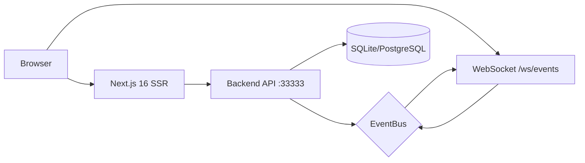

# Ark Web Dashboard — 設計文件

## 1. 設計目標

為 Ark Agent Platform 建立視覺化管理後台，讓使用者透過瀏覽器即時監控團隊、管理任務、追蹤費用。與 Telegram Bot 互補——TG 適合行動/快速操作，Web 適合深度分析與批量管理。

---

## 2. 架構設計



### 渲染策略

| 頁面類型 | 策略 | 理由 |
|----------|------|------|
| Dashboard KPI | RSC (revalidate 30s) | 減少 client JS |
| 圖表 | Client Component + SWR | 需要 interactivity |
| 即時資料 | WebSocket → useState | 零延遲 |
| 表格（Audit/Queue） | Client + SWR + pagination | 大量資料 |
| Session Inspector | Client Component | 高互動性 |

### 資料 Fetch 分層

```
Layer 1: RSC fetch (server-side, cacheable)
  └─ Dashboard stats, Agent list

Layer 2: SWR (client-side, auto-revalidate)
  └─ Trends, Costs, Audit, Sessions

Layer 3: WebSocket (real-time push)
  └─ Agent status changes, task events, cost updates
```

---

## 3. 元件架構

### 共用 Layout

```
┌──────────────────────────────────────────────────┐
│ Header (logo + breadcrumb + user + theme toggle) │
├────────┬─────────────────────────────────────────┤
│        │                                         │
│ Sidebar│  Content Area                           │
│        │                                         │
│ • 📊   │  (Router Outlet)                        │
│ • 🤖   │                                         │
│ • 📋   │                                         │
│ • 💰   │                                         │
│ • 📝   │                                         │
│ • ⚙️   │                                         │
│        │                                         │
└────────┴─────────────────────────────────────────┘
```

### 元件依賴圖

```
AdminLayout
├── Sidebar
│   └── NavItem (active state via usePathname)
├── Header
│   ├── Breadcrumb
│   ├── ThemeToggle
│   └── UserMenu (API Key display)
└── ContentSlot
    ├── DashboardPage
    │   ├── KpiCard × 4
    │   ├── TrendChart (Recharts LineChart)
    │   ├── AgentGrid (CSS Grid + StatusDot)
    │   └── ActivityFeed (WS → list)
    ├── SessionInspectorPage
    │   ├── ConversationView (bubble layout)
    │   │   ├── MessageBubble (user/assistant)
    │   │   └── ToolCallAccordion (collapsible)
    │   ├── TokenMeter (progress bar)
    │   └── TimelineMarkers (vertical dots)
    └── ...
```

---

## 4. 狀態管理

```tsx
// 全域狀態（React Context）
interface AppState {
  apiKey: string | null
  theme: 'dark' | 'light'
  wsConnected: boolean
}

// 每頁資料（SWR）
const { data: stats } = useSWR('/api/admin/dashboard/stats', fetcher, { refreshInterval: 30000 })
const { data: costs } = useSWR('/api/admin/costs', fetcher)

// 即時事件（WebSocket → local state）
const events = useEventStream()  // 最近 50 筆
```

**為什麼不用 Redux/Zustand**：
- 頁面間無複雜共享狀態
- SWR cache 已處理 server state
- WebSocket 事件用 local state 足夠
- 降低 bundle size

---

## 5. 替代方案比較

| | 方案 A: Next.js App Router | 方案 B: Vite SPA | 方案 C: Remix |
|---|---|---|---|
| SSR | ✅ RSC | ❌ 純 CSR | ✅ |
| Bundle | 小（RSC 減少 JS） | 大 | 中 |
| 對齊 Multica | ✅ 一致 | ❌ 不同 | ❌ |
| 開發速度 | 快（shadcn） | 快 | 中 |
| SEO | ✅ | ❌ | ✅ |

**決策：方案 A（Next.js App Router）**

理由：對齊 Multica 原生架構、RSC 減少 client JS、shadcn/ui 加速 UI 開發。

---

## 6. WebSocket 設計

```tsx
// hooks/useEventStream.ts
export function useEventStream() {
  const [events, setEvents] = useState<Event[]>([])
  const [connected, setConnected] = useState(false)
  const reconnectRef = useRef<NodeJS.Timeout>()

  useEffect(() => {
    let ws: WebSocket

    function connect() {
      ws = new WebSocket(`ws://${location.hostname}:33333/api/ws/events`)
      ws.onopen = () => setConnected(true)
      ws.onclose = () => {
        setConnected(false)
        reconnectRef.current = setTimeout(connect, 3000) // auto-reconnect
      }
      ws.onmessage = (msg) => {
        const event = JSON.parse(msg.data)
        setEvents(prev => [event, ...prev].slice(0, 50))
      }
    }

    connect()
    return () => { ws?.close(); clearTimeout(reconnectRef.current) }
  }, [])

  return { events, connected }
}
```

**事件 → UI 更新映射：**

| 事件 | 影響頁面 | 動作 |
|------|---------|------|
| agent.output | Dashboard, Sessions | 更新 AgentGrid status + 新增 session |
| task.completed | Dashboard, Queue | KPI +1, 從 queue 移除 |
| task.failed | Dashboard | 失敗計數 +1, toast 通知 |
| cost.recorded | Costs | 即時更新費用圖表 |
| budget.warning | All | 全域 banner 警告 |

---

## 7. 認證設計

```
┌─────────────┐     ┌──────────────┐     ┌─────────────┐
│ /login      │────>│ 輸入 API Key │────>│ localStorage│
│ (no auth)   │     │ 驗證 /health │     │ 存入 key    │
└─────────────┘     └──────────────┘     └──────┬──────┘
                                                 │
                         ┌───────────────────────▼──────┐
                         │ middleware.ts                  │
                         │ 每個 /admin/* 請求檢查 key    │
                         │ 無 key → redirect /login     │
                         └───────────────────────────────┘
```

```ts
// middleware.ts
export function middleware(request: NextRequest) {
  if (request.nextUrl.pathname.startsWith('/admin')) {
    const key = request.cookies.get('api_key')
    if (!key) return NextResponse.redirect(new URL('/login', request.url))
  }
}
```

---

## 8. 效能設計

| 面向 | 策略 |
|------|------|
| 首次載入 | RSC 減少 JS bundle（KPI 純 server render） |
| 圖表 | dynamic import（lazy load Recharts） |
| 大表格 | @tanstack/react-virtual（虛擬滾動） |
| 圖片 | 無圖片（純 UI，avatar 用 initials） |
| WebSocket | 單一連線 + 事件 dispatch |
| SWR | dedup + revalidateOnFocus |

**效能目標：**
- LCP < 1.5s
- FID < 100ms
- Audit 頁 1000 筆渲染 < 16ms/frame

---

## 9. 部署

### 開發

```bash
cd apps/web && pnpm dev  # → http://localhost:3000
```

自動 proxy `/api/*` 到 Backend :33333。

### 生產

```dockerfile
# Dockerfile.web
FROM node:20-alpine AS builder
WORKDIR /app
COPY apps/web/ .
RUN pnpm install && pnpm build

FROM node:20-alpine
WORKDIR /app
COPY --from=builder /app/.next .next
COPY --from=builder /app/public public
COPY --from=builder /app/node_modules node_modules
COPY --from=builder /app/package.json .
EXPOSE 3000
CMD ["pnpm", "start"]
```

docker-compose 加入：
```yaml
  web:
    build:
      context: .
      dockerfile: Dockerfile.web
    ports: ["3000:3000"]
    environment:
      - NEXT_PUBLIC_API_URL=http://backend:33333
    depends_on: [backend]
```

---

## 10. 風險

| 風險 | 緩解 |
|------|------|
| WebSocket 斷線 | 自動重連（3s interval）+ 斷線 banner |
| Backend API 慢 | SWR staleWhileRevalidate + skeleton loading |
| 大量 audit events | 虛擬滾動 + server-side pagination |
| 多人同時操作 queue | optimistic update + 衝突提示 |
