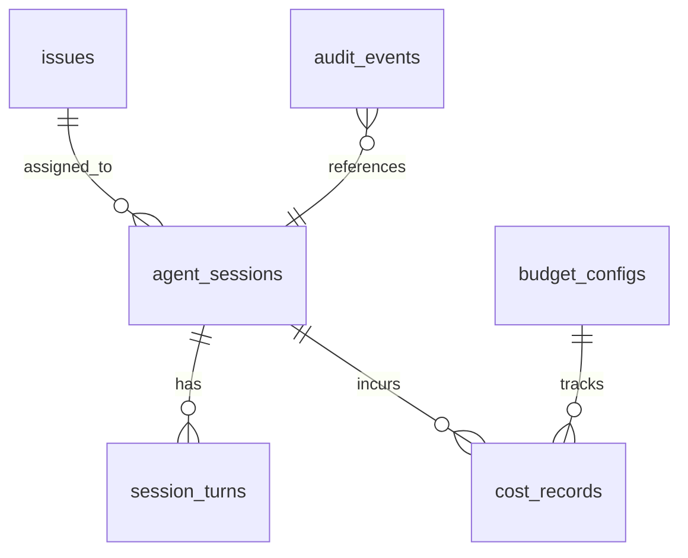

# Ark Backend Tool — 規格書

> Agent Team 後端管理工具層，將 282 行最小 daemon 升級為生產級後端服務。

---

## 1. 問題陳述

現有 `ark_team_core` 為 282 行的最小 daemon 實作，提供基礎的 agent 生命週期管理。
然而在實際運營中暴露以下關鍵缺陷：

| 缺陷 | 現狀 | 影響 |
|------|------|------|
| 無持久化 | session/cost/audit 全在記憶體 | 重啟即遺失所有歷史 |
| 無即時通訊 | 只有 CLI 輪詢 | 無法推送事件到前端/Bot |
| 無 REST API | 僅 MCP tool 介面 | 無法整合 Dashboard/外部系統 |
| 排程唯讀 | 僅讀 YAML 定義 | 無法動態新增/修改排程 |
| 無費用追蹤 | 不記錄 token 消耗 | 無法控制預算 |
| 無健康監控 | agent 掛了無感知 | 靜默失敗，需人工介入 |

### 業務影響

- **可靠性**：記憶體資料在 daemon 重啟後全數遺失，無法追溯歷史
- **可觀測性**：無法得知 agent 即時狀態、費用消耗、失敗率
- **可擴展性**：無 API 層，第三方整合（Dashboard、Telegram UI）無入口
- **成本控制**：無法設定預算上限，存在費用失控風險

---

## 2. 目標與非目標

### ✅ 目標

| # | 目標 | 衡量指標 |
|---|------|---------|
| G1 | Admin API — 5 個域（dashboard/sessions/costs/audit/queue） | 15+ REST endpoints 可用 |
| G2 | Event Bus — asyncio pub/sub 即時事件分發 | 事件延遲 < 1s |
| G3 | 持久化 — 6 張表完整 schema | 重啟後資料 100% 保留 |
| G4 | 費用自動記錄 — 每次 kiro-cli spawn 後計算 | 每筆呼叫有 cost record |
| G5 | 審計自動記錄 — 所有 API mutation 留痕 | audit_events 覆蓋率 100% |
| G6 | 健康監控 + 自動重啟 | agent 異常 < 30s 偵測並重啟 |
| G7 | WebSocket 即時推送 | 前端/Bot 可訂閱事件串流 |

### ❌ 非目標

| 項目 | 原因 | 負責模組 |
|------|------|---------|
| Web 前端 Dashboard UI | 獨立前端專案 | `ark-dashboard-ui` |
| Mobile App | 不在本期範圍 | 未規劃 |
| Telegram Bot 整合 | 由專責 Skill 處理 | `ark-telegram-ui` |
| LLM 模型訓練/微調 | 超出工具層職責 | N/A |
| 多租戶隔離 | 單一團隊使用 | 未來版本 |

---


## 3. 核心設計

### 3.1 架構總覽

```
┌─────────────────────────────────────────────────────────────────┐
│                        API Layer (FastAPI)                        │
│  ┌──────────┐ ┌──────────┐ ┌──────────┐ ┌──────────┐ ┌───────┐ │
│  │  admin   │ │  agents  │ │  issues  │ │  costs   │ │  ws   │ │
│  └────┬─────┘ └────┬─────┘ └────┬─────┘ └────┬─────┘ └───┬───┘ │
├───────┼─────────────┼────────────┼────────────┼───────────┼─────┤
│       │         Service Layer    │            │           │     │
│  ┌────┴─────┐ ┌────┴─────┐ ┌────┴─────┐ ┌───┴────┐     │     │
│  │  health  │ │  audit   │ │  cost    │ │ sched  │     │     │
│  │  monitor │ │  logger  │ │  tracker │ │ engine │     │     │
│  └────┬─────┘ └────┬─────┘ └────┬─────┘ └───┬────┘     │     │
├───────┼─────────────┼────────────┼────────────┼───────────┼─────┤
│       │         Event Bus (asyncio pub/sub)   │           │     │
│       └─────────────┴────────────┴────────────┴───────────┘     │
├─────────────────────────────────────────────────────────────────┤
│                    Database Layer (SQLAlchemy)                    │
│  ┌───────────────┐ ┌───────────────┐ ┌───────────────────────┐ │
│  │ agent_sessions│ │ cost_records  │ │ audit_events          │ │
│  │ session_turns │ │ budget_configs│ │ issues                │ │
│  └───────────────┘ └───────────────┘ └───────────────────────┘ │
├─────────────────────────────────────────────────────────────────┤
│                 ark_team_core (existing, 小改)                    │
│  config.py │ process.py (+hook) │ daemon.py (+emit) │ scheduler │
└─────────────────────────────────────────────────────────────────┘
```

### 3.2 目錄結構

```
src/ark_team_core/              # 現有（小改）
├── config.py                   # 不動
├── process.py                  # +cost hook（spawn 後記錄 duration + 估算 tokens）
├── daemon.py                   # +event bus emit（agent lifecycle events）
├── mcp_registry.py             # 不動
└── scheduler.py                # +CRUD methods（add/update/delete schedule）

src/backend/                    # 新增
├── __init__.py
├── api/
│   ├── __init__.py
│   ├── router.py               # FastAPI app + CORS + error handling middleware
│   ├── admin.py                # GET /api/admin/dashboard/stats
│   │                           # GET /api/admin/dashboard/timeline
│   │                           # GET /api/admin/system/health
│   ├── agents.py               # Agent CRUD + control (start/stop/abort/restart)
│   ├── issues.py               # Issue lifecycle (create/assign/complete/fail)
│   ├── costs.py                # Cost query + budget management
│   ├── schedules.py            # Schedule CRUD (dynamic)
│   └── ws.py                   # WebSocket /ws/events (subscribe by type)
├── db/
│   ├── __init__.py
│   ├── database.py             # async engine + session factory
│   ├── models.py               # 6 SQLAlchemy ORM models
│   └── migrations/
│       └── 001_initial.sql
├── events/
│   ├── __init__.py
│   ├── bus.py                  # EventBus class (asyncio.Queue based pub/sub)
│   ├── types.py                # EventType enum + Event dataclass
│   └── handlers.py             # auto-subscribe: cost_tracker + audit_logger
└── services/
    ├── __init__.py
    ├── cost_tracker.py         # 費用追蹤（subscribe agent.stopped → 計算 cost）
    ├── audit_logger.py         # 審計日誌（subscribe *.* → 記錄 mutation）
    └── health_monitor.py       # 健康監控（periodic check + auto restart）
```

### 3.3 現有模組改動（最小侵入）

| 檔案 | 改動 | 行數估計 |
|------|------|---------|
| `process.py` | spawn 完成後 emit `agent.stopped` + 計算 duration | +15 行 |
| `daemon.py` | 啟動時初始化 EventBus，各操作後 emit event | +25 行 |
| `scheduler.py` | 新增 `add_schedule()`/`update_schedule()`/`delete_schedule()` | +40 行 |

原則：**不破壞現有 MCP tool 介面**，所有新功能透過 Event Bus 解耦。

---


## 4. 資料庫 Schema

### 4.1 ER 關係



### 4.2 完整 DDL

```sql
-- ============================================================
-- Table 1: agent_sessions
-- 記錄每個 agent 的生命週期（一次 spawn = 一筆 session）
-- ============================================================
CREATE TABLE agent_sessions (
    id              TEXT PRIMARY KEY DEFAULT (lower(hex(randomblob(16)))),
    agent_name      TEXT NOT NULL,
    role            TEXT NOT NULL DEFAULT 'worker',
    status          TEXT NOT NULL DEFAULT 'pending'
                    CHECK (status IN ('pending','running','completed','failed','aborted')),
    issue_id        TEXT REFERENCES issues(id),
    prompt          TEXT,
    result          TEXT,
    model           TEXT DEFAULT 'claude-sonnet-4-20250514',
    pid             INTEGER,
    started_at      TIMESTAMP,
    completed_at    TIMESTAMP,
    duration_ms     INTEGER,
    exit_code       INTEGER,
    error_message   TEXT,
    metadata        JSON DEFAULT '{}',
    created_at      TIMESTAMP NOT NULL DEFAULT CURRENT_TIMESTAMP,
    updated_at      TIMESTAMP NOT NULL DEFAULT CURRENT_TIMESTAMP
);

CREATE INDEX idx_sessions_status ON agent_sessions(status);
CREATE INDEX idx_sessions_agent ON agent_sessions(agent_name);
CREATE INDEX idx_sessions_issue ON agent_sessions(issue_id);
CREATE INDEX idx_sessions_created ON agent_sessions(created_at DESC);

-- ============================================================
-- Table 2: session_turns
-- 記錄 agent 的每一輪對話（user/assistant/tool）
-- ============================================================
CREATE TABLE session_turns (
    id              TEXT PRIMARY KEY DEFAULT (lower(hex(randomblob(16)))),
    session_id      TEXT NOT NULL REFERENCES agent_sessions(id) ON DELETE CASCADE,
    turn_index      INTEGER NOT NULL,
    role            TEXT NOT NULL CHECK (role IN ('user','assistant','tool','system')),
    content         TEXT,
    tool_name       TEXT,
    tool_input      JSON,
    tool_output     JSON,
    tokens_in       INTEGER DEFAULT 0,
    tokens_out      INTEGER DEFAULT 0,
    duration_ms     INTEGER,
    created_at      TIMESTAMP NOT NULL DEFAULT CURRENT_TIMESTAMP
);

CREATE INDEX idx_turns_session ON session_turns(session_id, turn_index);

-- ============================================================
-- Table 3: cost_records
-- 每次 LLM 呼叫的費用記錄
-- ============================================================
CREATE TABLE cost_records (
    id              TEXT PRIMARY KEY DEFAULT (lower(hex(randomblob(16)))),
    session_id      TEXT REFERENCES agent_sessions(id) ON DELETE SET NULL,
    agent_name      TEXT NOT NULL,
    model           TEXT NOT NULL,
    tokens_in       INTEGER NOT NULL DEFAULT 0,
    tokens_out      INTEGER NOT NULL DEFAULT 0,
    cost_usd        REAL NOT NULL DEFAULT 0.0,
    duration_ms     INTEGER,
    budget_id       TEXT REFERENCES budget_configs(id),
    metadata        JSON DEFAULT '{}',
    created_at      TIMESTAMP NOT NULL DEFAULT CURRENT_TIMESTAMP
);

CREATE INDEX idx_costs_session ON cost_records(session_id);
CREATE INDEX idx_costs_agent ON cost_records(agent_name);
CREATE INDEX idx_costs_created ON cost_records(created_at DESC);
CREATE INDEX idx_costs_budget ON cost_records(budget_id);

-- ============================================================
-- Table 4: audit_events
-- 所有 API mutation 的審計軌跡
-- ============================================================
CREATE TABLE audit_events (
    id              TEXT PRIMARY KEY DEFAULT (lower(hex(randomblob(16)))),
    event_type      TEXT NOT NULL,
    actor           TEXT NOT NULL DEFAULT 'system',
    target_type     TEXT,
    target_id       TEXT,
    action          TEXT NOT NULL,
    details         JSON DEFAULT '{}',
    ip_address      TEXT,
    session_id      TEXT REFERENCES agent_sessions(id) ON DELETE SET NULL,
    created_at      TIMESTAMP NOT NULL DEFAULT CURRENT_TIMESTAMP
);

CREATE INDEX idx_audit_type ON audit_events(event_type);
CREATE INDEX idx_audit_actor ON audit_events(actor);
CREATE INDEX idx_audit_target ON audit_events(target_type, target_id);
CREATE INDEX idx_audit_created ON audit_events(created_at DESC);

-- ============================================================
-- Table 5: issues
-- 任務/問題追蹤（對應 GitHub Issue 或內部任務）
-- ============================================================
CREATE TABLE issues (
    id              TEXT PRIMARY KEY DEFAULT (lower(hex(randomblob(16)))),
    external_id     TEXT,
    source          TEXT DEFAULT 'internal' CHECK (source IN ('github','internal','telegram')),
    title           TEXT NOT NULL,
    body            TEXT,
    status          TEXT NOT NULL DEFAULT 'open'
                    CHECK (status IN ('open','assigned','in_progress','completed','failed','cancelled')),
    priority        TEXT DEFAULT 'medium'
                    CHECK (priority IN ('critical','high','medium','low')),
    assigned_agent  TEXT,
    labels          JSON DEFAULT '[]',
    result_summary  TEXT,
    branch_name     TEXT,
    pr_url          TEXT,
    attempts        INTEGER DEFAULT 0,
    max_attempts    INTEGER DEFAULT 3,
    metadata        JSON DEFAULT '{}',
    created_at      TIMESTAMP NOT NULL DEFAULT CURRENT_TIMESTAMP,
    updated_at      TIMESTAMP NOT NULL DEFAULT CURRENT_TIMESTAMP,
    completed_at    TIMESTAMP
);

CREATE INDEX idx_issues_status ON issues(status);
CREATE INDEX idx_issues_priority ON issues(priority);
CREATE INDEX idx_issues_agent ON issues(assigned_agent);

-- ============================================================
-- Table 6: budget_configs
-- 費用預算配置（per-agent 或 global）
-- ============================================================
CREATE TABLE budget_configs (
    id              TEXT PRIMARY KEY DEFAULT (lower(hex(randomblob(16)))),
    name            TEXT NOT NULL UNIQUE,
    scope           TEXT NOT NULL DEFAULT 'global'
                    CHECK (scope IN ('global','agent','model')),
    scope_value     TEXT,
    daily_limit_usd REAL,
    weekly_limit_usd REAL,
    monthly_limit_usd REAL,
    alert_threshold REAL DEFAULT 0.8,
    enabled         BOOLEAN DEFAULT TRUE,
    metadata        JSON DEFAULT '{}',
    created_at      TIMESTAMP NOT NULL DEFAULT CURRENT_TIMESTAMP,
    updated_at      TIMESTAMP NOT NULL DEFAULT CURRENT_TIMESTAMP
);

CREATE INDEX idx_budget_scope ON budget_configs(scope, scope_value);
```

### 4.3 費率表（內嵌於 cost_tracker）

| 模型 | Input $/1K tokens | Output $/1K tokens |
|------|-------------------|-------------------|
| claude-sonnet-4-20250514 | 0.003 | 0.015 |
| claude-opus-4-20250514 | 0.015 | 0.075 |
| gemini-2.5-flash | 0.00015 | 0.0006 |
| gemini-2.5-pro | 0.00125 | 0.005 |

---


## 5. API 端點完整列表

Base URL: `http://localhost:8420/api`

### 5.1 Admin Domain

| # | Method | Path | 說明 |
|---|--------|------|------|
| 1 | GET | `/admin/dashboard/stats` | 總覽統計（agent 數、成功率、費用、佇列長度） |
| 2 | GET | `/admin/dashboard/timeline` | 近 24h 事件時間軸 |
| 3 | GET | `/admin/system/health` | 系統健康狀態 |

#### `GET /api/admin/dashboard/stats`

**Response 200:**
```json
{
  "agents": {
    "total": 12,
    "running": 3,
    "completed": 8,
    "failed": 1
  },
  "costs": {
    "today_usd": 2.45,
    "week_usd": 18.72,
    "month_usd": 45.30,
    "budget_remaining_pct": 0.65
  },
  "issues": {
    "open": 5,
    "in_progress": 2,
    "completed_today": 3
  },
  "queue": {
    "pending": 4,
    "avg_wait_ms": 1200
  }
}
```

#### `GET /api/admin/system/health`

**Response 200:**
```json
{
  "status": "healthy",
  "uptime_seconds": 86400,
  "daemon_pid": 12345,
  "db_connected": true,
  "event_bus_active": true,
  "agents_running": 3,
  "last_health_check": "2026-06-17T09:30:00Z"
}
```

### 5.2 Agent Domain

| # | Method | Path | 說明 |
|---|--------|------|------|
| 4 | GET | `/agents/sessions` | 列出 sessions（支援分頁/篩選） |
| 5 | GET | `/agents/sessions/{id}` | 取得單一 session 詳情 |
| 6 | GET | `/agents/sessions/{id}/turns` | 取得 session 對話記錄 |
| 7 | POST | `/agents/spawn` | 產生新 agent |
| 8 | POST | `/agents/sessions/{id}/abort` | 中止運行中 agent |
| 9 | POST | `/agents/sessions/{id}/restart` | 重啟失敗的 agent |

#### `GET /api/agents/sessions`

**Query Params:**
- `status` (optional): `pending|running|completed|failed|aborted`
- `agent_name` (optional): 篩選特定 agent
- `limit` (default: 50, max: 200)
- `offset` (default: 0)
- `order_by` (default: `created_at:desc`)

**Response 200:**
```json
{
  "items": [
    {
      "id": "a1b2c3d4...",
      "agent_name": "coder",
      "role": "worker",
      "status": "completed",
      "issue_id": "issue-123",
      "model": "claude-sonnet-4-20250514",
      "duration_ms": 45000,
      "cost_usd": 0.12,
      "created_at": "2026-06-17T08:00:00Z",
      "completed_at": "2026-06-17T08:00:45Z"
    }
  ],
  "total": 128,
  "limit": 50,
  "offset": 0
}
```

#### `POST /api/agents/spawn`

**Request Body:**
```json
{
  "agent_name": "coder",
  "role": "worker",
  "prompt": "Fix the login bug in auth.py",
  "issue_id": "issue-456",
  "model": "claude-sonnet-4-20250514",
  "timeout_ms": 300000,
  "metadata": {"priority": "high"}
}
```

**Response 201:**
```json
{
  "session_id": "e5f6g7h8...",
  "agent_name": "coder",
  "status": "pending",
  "created_at": "2026-06-17T09:00:00Z"
}
```

### 5.3 Issue Domain

| # | Method | Path | 說明 |
|---|--------|------|------|
| 10 | GET | `/issues` | 列出所有 issues |
| 11 | POST | `/issues` | 建立新 issue |
| 12 | PATCH | `/issues/{id}` | 更新 issue 狀態/欄位 |
| 13 | POST | `/issues/{id}/assign` | 指派 agent 處理 |

#### `POST /api/issues`

**Request Body:**
```json
{
  "title": "Fix authentication timeout",
  "body": "Users report 504 errors on login after 30s...",
  "priority": "high",
  "labels": ["bug", "auth"],
  "source": "github",
  "external_id": "owner/repo#42"
}
```

**Response 201:**
```json
{
  "id": "iss-abc123",
  "title": "Fix authentication timeout",
  "status": "open",
  "priority": "high",
  "created_at": "2026-06-17T09:05:00Z"
}
```

#### `PATCH /api/issues/{issue_id}/assign`

**Request Body:**
```json
{
  "agent_name": "coder",
  "model": "claude-sonnet-4-20250514",
  "auto_start": true
}
```

**Response 200:**
```json
{
  "issue_id": "iss-abc123",
  "status": "assigned",
  "session_id": "sess-xyz789",
  "agent_name": "coder"
}
```

### 5.4 Cost Domain

| # | Method | Path | 說明 |
|---|--------|------|------|
| 14 | GET | `/costs/summary` | 費用摘要（日/週/月） |
| 15 | GET | `/costs/records` | 費用明細（分頁） |
| 16 | GET | `/costs/budgets` | 列出預算配置 |
| 17 | POST | `/costs/budgets` | 建立/更新預算 |

#### `GET /api/admin/costs/summary`

**Query Params:**
- `period`: `today|week|month|custom`
- `from` / `to` (ISO 8601, for custom period)
- `group_by`: `agent|model|day`

**Response 200:**
```json
{
  "period": "week",
  "total_usd": 18.72,
  "total_tokens_in": 2450000,
  "total_tokens_out": 890000,
  "total_sessions": 45,
  "by_agent": {
    "coder": {"cost_usd": 12.30, "sessions": 28},
    "reviewer": {"cost_usd": 4.50, "sessions": 12},
    "planner": {"cost_usd": 1.92, "sessions": 5}
  },
  "by_model": {
    "claude-sonnet-4-20250514": {"cost_usd": 15.20, "sessions": 38},
    "claude-opus-4-20250514": {"cost_usd": 3.52, "sessions": 7}
  },
  "budget_status": {
    "daily_used_pct": 0.45,
    "weekly_used_pct": 0.62,
    "monthly_used_pct": 0.38
  }
}
```

### 5.5 Schedule Domain

| # | Method | Path | 說明 |
|---|--------|------|------|
| 18 | GET | `/schedules` | 列出排程 |
| 19 | POST | `/schedules` | 新增排程 |
| 20 | PATCH | `/schedules/{id}` | 更新排程 |
| 21 | DELETE | `/schedules/{id}` | 刪除排程 |
| 22 | POST | `/schedules/{id}/trigger` | 立即觸發 |

### 5.6 WebSocket

| # | Protocol | Path | 說明 |
|---|----------|------|------|
| 23 | WS | `/ws/events` | 即時事件串流 |

#### `WS /ws/events`

**Connection Query Params:**
- `subscribe`: 逗號分隔的事件類型（如 `agent.*,cost.recorded`）
- `token`: 認證 token（optional）

**Server Push Message:**
```json
{
  "event_type": "agent.stopped",
  "timestamp": "2026-06-17T09:01:00Z",
  "data": {
    "session_id": "sess-xyz789",
    "agent_name": "coder",
    "status": "completed",
    "duration_ms": 45000,
    "cost_usd": 0.12
  }
}
```

---

